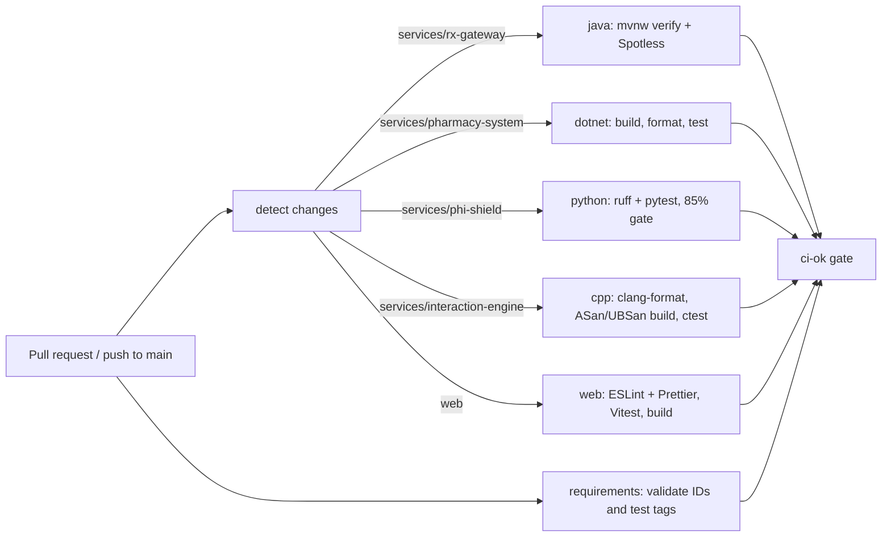

# CI/CD

## CI (`.github/workflows/ci.yml`)

- Jobs run only when their paths change. Changes to `contracts/`, `terminology/` or the workflow run every job.
- `ci-ok` is the single required status check. It passes when every other job either passed or was skipped.
- Caches: Maven (setup-java), NuGet (`~/.nuget/packages`), pip (setup-python), npm (setup-node), CMake FetchContent (`build/_deps`).
- Test reports (JUnit XML, TRX) are uploaded as artifacts. They feed the traceability matrix in Phase 13.
- All third-party actions are pinned to commit SHAs. Dependabot updates them weekly.

CD (GHCR → Render → smoke tests) is added in Phase 1.

## Free-tier limits (checked against provider docs)

| Provider | Limit | Checked |
|---|---|---|
| Render free web service | 0.1 CPU / 512 MB; spins down after 15 min idle; 750 instance-hours/month in total | 2026-09-25 |
| Render free Postgres | Expires after 30 days (not used) | 2026-09-25 |
| Neon free | 0.5 GB storage, 100 CU-hours per project | 2026-09-25 |

Sources and the resulting decisions are in [ADR 0003](decisions/0003-free-hosting.md).
