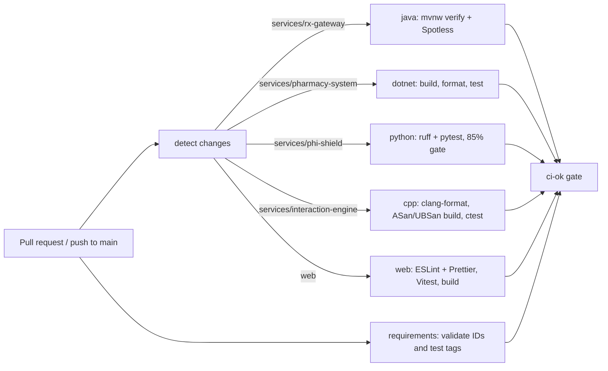
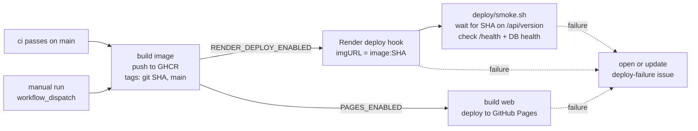

# CI/CD

## CI (`.github/workflows/ci.yml`)


```mermaid
flowchart LR
  PR[Pull request / push to main] --> C[detect changes]
  C -->|services/rx-gateway| J[java: mvnw verify + Spotless]
  C -->|services/pharmacy-system| D[dotnet: build, format, test]
  C -->|services/phi-shield| P[python: ruff + pytest, 85% gate]
  C -->|services/interaction-engine| X[cpp: clang-format, ASan/UBSan build, ctest]
  C -->|web| W[web: ESLint + Prettier, Vitest, build]
  PR --> R[requirements: validate IDs and test tags]
  J & D & P & X & W & R --> OK[ci-ok gate]
```

- Jobs run only when their paths change. Changes to `contracts/`, `terminology/` or the workflow run every job.
- `ci-ok` is the single required status check. It passes when every other job either passed or was skipped.
- Caches: Maven (setup-java), NuGet (`~/.nuget/packages`), pip (setup-python), npm (setup-node), CMake FetchContent (`build/_deps`).
- Test reports (JUnit XML, TRX) are uploaded as artifacts. They feed the traceability matrix in Phase 13.
- All third-party actions are pinned to commit SHAs. Dependabot updates them weekly.

## CD (`.github/workflows/cd.yml`)


```mermaid
flowchart LR
  CI[ci passes on main] --> IMG[build image<br/>push to GHCR<br/>tags: git SHA, main]
  D[manual run<br/>workflow_dispatch] --> IMG
  IMG -->|RENDER_DEPLOY_ENABLED| HOOK[Render deploy hook<br/>imgURL = image:SHA]
  HOOK --> SMOKE[deploy/smoke.sh<br/>wait for SHA on /api/version<br/>check /health + DB health]
  IMG -->|PAGES_ENABLED| PAGES[build web<br/>deploy to GitHub Pages]
  SMOKE -. failure .-> ISSUE[open or update<br/>deploy-failure issue]
  PAGES -. failure .-> ISSUE
  HOOK -. failure .-> ISSUE
```

- CD starts from a successful `ci` run on a push to `main` (`workflow_run`), or manually. It always builds the exact commit that CI tested (`workflow_run.head_sha`).
- The Render service is image-backed. The deploy hook gets `imgURL=ghcr.io/amitchouguleack/rxguard-rx-gateway:<sha>`, so the tested image is exactly what runs ([ADR 0007](decisions/0007-image-based-deploys.md)).
- `deploy/smoke.sh` allows up to 15 minutes, because a deploy plus a free-tier cold start is slow. It passes only when `/api/version` reports the new SHA, and `/health` and `/actuator/health` (which includes the database) report `UP`.
- Any failed job opens a `deploy-failure` issue, or comments on the one already open.

### Configuration

| Name | Kind | Value |
|---|---|---|
| `RENDER_GATEWAY_DEPLOY_HOOK` | Actions secret | Render → service → Settings → Deploy Hook. The `key` parameter is a credential, and the workflow never prints it. |
| `GATEWAY_URL` | Actions variable | The service's `https://….onrender.com` URL |
| `RENDER_DEPLOY_ENABLED` | Actions variable | `true` once the Render service exists |
| `PAGES_ENABLED` | Actions variable | `true` once Pages uses "GitHub Actions" as its source |

Database credentials (`DB_URL`, `DB_APP_PASSWORD`, `DB_MIGRATION_PASSWORD`) live only in Render's environment settings, never in GitHub.

### Rollback
Call the deploy hook with a previous image tag. Every merged commit has one in GHCR:

```bash
curl -fsS -X POST "$RENDER_GATEWAY_DEPLOY_HOOK&imgURL=ghcr.io%2Famitchouguleack%2Frxguard-rx-gateway%3A<previous-sha>"
deploy/smoke.sh "$GATEWAY_URL" <previous-sha>
```

This gets tested for real in Phase 13.

## Free-tier limits (checked against provider docs)

| Provider | Limit | Checked |
|---|---|---|
| Render free web service | 0.1 CPU / 512 MB; spins down after 15 min idle; 750 instance-hours/month in total | 2026-09-25 |
| Render free Postgres | Expires after 30 days (not used) | 2026-09-25 |
| Neon free | 0.5 GB storage, 100 CU-hours per project | 2026-09-25 |

Sources and the resulting decisions are in [ADR 0003](decisions/0003-free-hosting.md).
