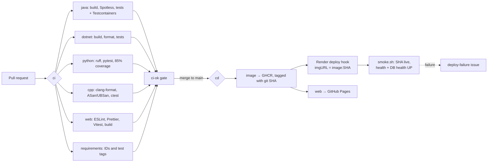

# Building RxGuard end to end

This is the story of how I built RxGuard on my own: what I planned, what I built in each phase, what broke, and how I fixed it. Everything here really happened. Every number comes from a real run, and the command to reproduce it is linked.

- [Planning](#planning)
- [Building, phase by phase](#building-phase-by-phase)
- [Debugging](#debugging)
- [Testing](#testing)
- [CI/CD](#cicd)
- [Deployment](#deployment)
- [Results and what's next](#results-and-whats-next)

---

## Planning

I've spent more than ten years around e-prescribing and banking systems, and the hard parts are rarely the screens. They're the boundaries between systems:
- a hospital sending HL7 v2
- a pharmacy on a different vendor's stack
- a regulator who expects an audit trail
- a clinician who ignores the fiftieth alert of the day

I wanted one project that shows all of those boundaries working together, so I planned RxGuard as four services in four languages, each doing the job that language really does in healthcare IT:

| Service | Language | Why |
|---|---|---|
| rx-gateway | Java 25 + Spring Boot | Interface engines and FHIR servers (HAPI) live in Java |
| interaction-engine | C++20 | Deterministic, fast safety checks, compiled natively and to WebAssembly |
| pharmacy-system | C# / .NET 10 | Many pharmacy systems are .NET, so this shows two vendors integrating |
| phi-shield | Python 3.12 | De-identification, terminology matching and anomaly detection |

I set some rules before writing any code:
- **$0 budget.** Free tiers only, and no card on file anywhere.
- **Synthetic data only.** Every screen says "SYNTHETIC DATA — NOT FOR CLINICAL USE."
- **Honest compliance wording.** "Built with HIPAA Security Rule safeguards in mind", never "HIPAA-compliant".
- **Requirements first.** Every requirement gets an ID, and every test names the requirement it proves.
- **A professional process, even solo.** An issue, a branch and a PR per phase, and merge only on green CI.
- **A real journal.** Every real failure gets written down.

The plan has 15 phases, from foundation to polish. Live progress is in [PROGRESS.md](PROGRESS.md).

## Building, phase by phase

### Phase 0: Foundation ([PR #5](https://github.com/amitchouguleack/rxguard/pull/5))
Before the first commit, I set up a local `commit-msg` hook and exclude rules. That way authorship stays mine and local tool files never land in the repo. I tested the hook with a throwaway commit and then reset it.

Then I verified that the stack I wanted is actually supported, instead of assuming. Spring Boot 4.1.1's documentation says it supports Java 17 through 26, and the Foreign Function & Memory API has been final since Java 22. So I chose Java 25 LTS with no preview flags ([ADR 0001](decisions/0001-java-version.md)).

I built a "hello + `/health`" skeleton in every language, along with:
- docker compose profiles, so my 2-core Codespace only runs what I need
- a dev container that pins every toolchain
- a baseline of 33 requirements and a starter list of 10 hazards
- a CI check that rejects any test tagged with a requirement ID that doesn't exist

Every language's linter also fails the build if a source file is missing its copyright header. I checked each one by deleting a header and watching it fail.

CI uses path filters, so a change to one service only builds that service. Skipped jobs and required status checks don't mix, so I added a single `ci-ok` gate job. It passes when every other job passed or was skipped, and branch protection requires only that one check.

Two dependency decisions came out of license and compatibility checks:
- **FluentAssertions stays on 7.x**, the last Apache-2.0 release, because 8.x moved to a commercial license.
- **ESLint stays on 9**, because the accessibility lint plugin doesn't support ESLint 10 yet.

Dependabot is told not to undo either choice.

### Phase 1: Walking skeleton, deployed on day one ([PR #14](https://github.com/amitchouguleack/rxguard/pull/14), [PR #16](https://github.com/amitchouguleack/rxguard/pull/16))
The goal was a public URL in the first week, so every later phase ships continuously.

- **Least-privilege database access** ([ADR 0005](decisions/0005-database-roles.md)):
  - rx-gateway talks to PostgreSQL through two roles. `gateway_owner` runs Flyway migrations. `gateway_app`, which the running service uses, can only read and write data: no DDL, no other schemas, not even the migration history.
  - A Testcontainers test runs the real bootstrap script through `psql` and then tries every forbidden action.
  - I made sure the test can fail: adding a single `GRANT CREATE` to the migration turns it red.
- **Sized for the free tier** ([ADR 0006](decisions/0006-jvm-memory-512mb.md)):
  - Render's free plan gives 512 MB and 0.1 CPU, so I tuned the JVM for startup instead of throughput: Serial GC, the C1 compiler only, and capped metaspace and code cache.
  - I measured it with the container limited to exactly those numbers. The tuned image answered `/health` in 56–61 s using about 121–128 MiB, compared with 120 s and 161–182 MiB with JVM defaults.
- **Deploy exactly what was tested** ([ADR 0007](decisions/0007-image-based-deploys.md)):
  - CD builds the image once, tags it with the git SHA, and tells Render to run that exact tag through the deploy hook.
  - The image knows its own SHA, so the smoke test waits until `/api/version` reports it before checking health.
  - If anything fails, CD opens a GitHub issue.
- **Honest about sleeping services:** the web UI on GitHub Pages shows a "Waking up services…" panel, because free services sleep after 15 minutes.

The first fully automatic run, triggered by merging PR #16, passed every job: image, Render deploy, smoke test and Pages. The new build was serving 45 seconds after the smoke test started.

## Debugging

Every entry below is a real failure from this build. The full write-ups are in the [engineering journal](ENGINEERING_JOURNAL.md), and each one has a GitHub issue.

### Containers that couldn't see each other (Phase 1, [#13](https://github.com/amitchouguleack/rxguard/issues/13))
- **Symptom:** rx-gateway died at startup: `FlywaySqlUnableToConnectToDbException ... SocketTimeoutException: Connect timed out`, connecting to `db:5432`.
- **Investigation:**
  - My first theory was that 0.1 CPU starved the JVM so badly that the driver timed out. To test it cheaply, I ran `pg_isready -h db` from a separate tiny container on the same network. It also got "no response". So did `ping` and `nc`. DNS was fine, and the host could reach Postgres through its published port.
  - That ruled out the JVM and pointed at the network. The Docker nftables rules looked right, but `iptables` warned that legacy tables also existed.
  - The legacy FORWARD chain had a policy of DROP and allowed only the default `docker0` bridge. Its drop counter showed 17 packets and 1,044 bytes, exactly matching the packets nftables had accepted from my compose bridge.
- **Root cause:** Leftover legacy-iptables rules in the Codespace image. Docker 29 writes its rules through nftables, so new compose bridges never got a legacy allow rule. With bridge netfilter on, the legacy chain dropped all container-to-container traffic.
- **Fix:** A narrow, non-persistent local rule that only allows traffic inside a single compose bridge: `iptables-legacy -I DOCKER-USER -i br-+ -o br-+ -j ACCEPT`.
- **Prevention:** The README's Codespaces section documents the symptom and the one-line fix. CI runners don't have the legacy rules, and Testcontainers uses published ports.
- **What I took from it:** When a timeout could mean "slow" or "blocked", test the same path with a trivial client first.

### The first Render deploy couldn't log in to the database (Phase 1, [#15](https://github.com/amitchouguleack/rxguard/issues/15))
- **Symptom:** The first deploy failed at startup with `password authentication failed for user gateway_owner`.
- **Investigation:** `gateway_owner` is the migration role, and Flyway uses it before the web server starts, so it was the first credential the app tried. I had created both roles on Neon with the bootstrap script and copied the passwords into Render by hand.
- **Root cause:** Not confirmed. I fixed it by rotating rather than by diagnosing the exact mismatch, and I'd rather say that than guess.
- **Fix:** I rotated both passwords in the Neon SQL Editor, updated them in Render and redeployed. The service went live, and `/actuator/health`, which includes the database, reported `UP`.
- **Prevention:** Startup fails fast on bad credentials, and the smoke test checks database health, so a bad password can never look like a healthy deploy. For the next services, I'll test each role with `psql` before pasting anything into a dashboard.

### Smaller ones (Phase 0)
- **`python3.12 -m venv` failed** ([#2](https://github.com/amitchouguleack/rxguard/issues/2)). My Codespace was created before the dev container existed, and Ubuntu splits `venv` into a separate package. I installed it. New Codespaces and CI get Python from pinned setup steps instead.
- **npm refused to install the accessibility lint plugin** ([#3](https://github.com/amitchouguleack/rxguard/issues/3)). It declares support only up to ESLint 9, and npm picked ESLint 10. I pinned ESLint 9 instead of forcing it with `--legacy-peer-deps`, and told Dependabot to leave it alone.
- **The second UI test found two copies of the page** ([#4](https://github.com/amitchouguleack/rxguard/issues/4)). Testing Library cleans up automatically only when test-runner globals are on, and I had deliberately turned them off. I added an explicit `cleanup()` in the shared setup file.

## Testing

- **Requirement-tagged from day one.** JUnit `@Tag`, pytest markers, xUnit traits, GoogleTest name prefixes and Vitest titles all name a `REQ-…` ID. CI rejects unknown IDs.
- **Real infrastructure in tests.** Database tests run against PostgreSQL 17 in Testcontainers, set up by the same bootstrap script used on Neon.
- **Tests that can fail.** For the security-critical tests, I broke the thing on purpose and watched the test go red before trusting it green.
- **Where things stand after Phase 1:**

  | Area | Tests |
  |---|---|
  | rx-gateway | 12 tests, including 6 database least-privilege tests |
  | web | 6 tests |
  | pharmacy-system | 2 tests |
  | phi-shield | 2 tests, 100% coverage against an 85% gate |
  | interaction-engine | 1 test under AddressSanitizer + UndefinedBehaviorSanitizer |

## CI/CD

- Jobs are path-filtered. Actions are pinned to commit SHAs. There are caches for Maven, NuGet, pip, npm and CMake.
- Branch protection requires the `ci-ok` gate, and every change reaches `main` through a PR.
- Details are in [CI_CD.md](CI_CD.md).

## Deployment

| Piece | Where | Cost |
|---|---|---|
| rx-gateway | Render free web service (prebuilt image) | $0 |
| PostgreSQL | Neon free plan | $0 |
| Web UI | GitHub Pages | $0 |
| Images | GitHub Container Registry | $0 |
| CI/CD | GitHub Actions | $0 |

The trade-offs I accepted, all checked against provider docs on 2026-09-25:
- **Cold starts.** Render's free services sleep after 15 minutes idle and get 750 instance-hours a month in total. Keeping three services awake would need about 2,160, so I don't ping them to keep them warm. The UI explains the wait instead. I measured it: after 18 minutes idle, the first `/health` took 52.4 s, and the next request took 0.14 s ([PERFORMANCE.md](PERFORMANCE.md)).
- **A database that sleeps.** Neon's free compute scales to zero after 5 minutes. The gateway keeps no idle connections, so it doesn't hold the database awake and burn compute hours.
- **No real PHI, ever.** None of these hosts has signed a Business Associate Agreement with me, so real patient data could never legally live here. That is exactly why RxGuard uses synthetic data only. In production I'd use BAA-covered services, a KMS for keys and always-on instances.

## Results and what's next

- **Live:** <https://amitchouguleack.github.io/rxguard/> (UI) and <https://rxguard-rx-gateway.onrender.com/api/version> (API).
- **Verified:** Every merge to `main` builds, deploys, smoke-tests and publishes automatically, and opens an issue if any step fails.
- **Next:** Phase 2, the core prescribing domain: synthetic patients, prescribers and medications, NPI/DEA/ICD-10-CM/LOINC validation, controlled-substance schedule rules, and license-safe terminology subsets.
